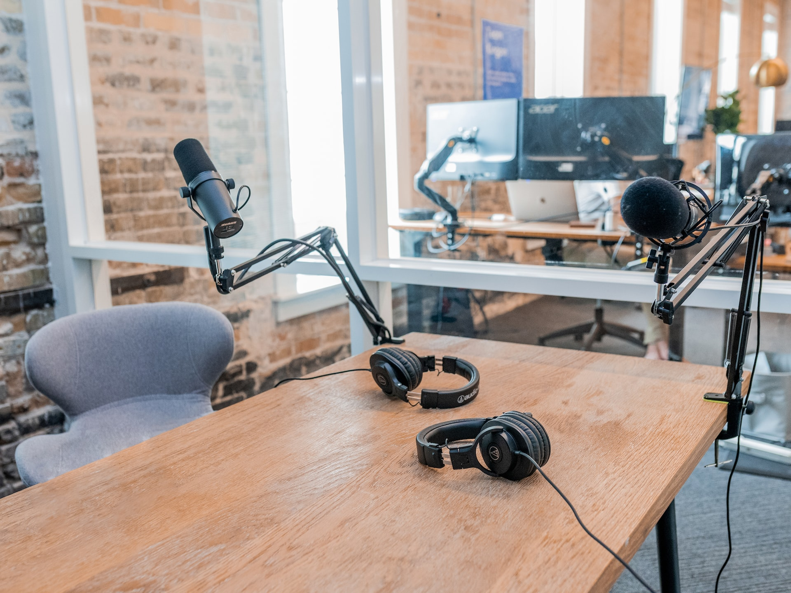

  

# deMenezesCast 🎙️

Antes de qualquer coisa: você gosta de podcast? Eu também!

Então acessa o projeto, e cadastra um podcast de sugestão para mim ;)

Obs.: os meus preferidos já estão lá, vc pode ver...

<div align="center">
  <a href="https://demenezescast.vercel.app/" target="_blank">
    <b>deMenezesCast >>></b>
  </a>
</div>

---



<div align="center"></div>

Esse projeto foi desenvolvido durante a [5ª Imersão React da Alura](https://www.alura.com.br/imersao-react).

## Tecnologias e linguagens

    

As tecnologias utilizadas pelos instrutores da Alura foram:

- **ReactJS** para desenvolvimento dos componentes e interface
- **NextJS** para roteamento, cabeçalho, metadados e organização dos providers da aplicação
- **Styled Components** para estilizar os componentes
- **Supabase** como o banco de dados que guarda as informações dos podcasts

Além disso, usei outras duas bibliotecas para complementar meu projeto:

- **ESLint** para criar uma padronização em todo o projeto
- **podcast-api** para fazer uma busca entre os podcasts (que futuramente são salvos no banco Supabase)

## Funcionalidades 💫

- Temas dark e light
- Preview em tempo real
- Modo tela cheia
- Responsivo
- Listagem de podcasts separados por categoria
- Filtro de podcasts
- Consulta de podcasts em uma ampla base de dados
- Salvar sugestões de podcast em um banco de dados no Supabase
- Atualização automática da tela assim que um podcast é salvo

### Implementar no futuro ⚒️

- Remover um podcast pela interface
- Escolher a categoria ao adicionar um podcast
- ...


## Screenshots 🖥️


---


---


---


## Como rodar o projeto 🔥

Execute os comandos abaixo:

```bash
$ git clone https://github.com/aaamenezes/demenezescast.git
$ cd demenezescast
$ npm i
$ npm run dev
```

## Links importantes

🌎 [Projeto em produção](https://demenezescast.vercel.app/)
👨‍💻 [Repositório](https://github.com/aaamenezes/demenezescast) 
🧑‍🏫 [Imersão Alura](https://www.alura.com.br/imersao-react)

## Instrutores

As pessoas responsáveis por todo esse aprendizado:

- [Mario Souto](https://github.com/omariosouto)
- [Nayanne Lopes](https://github.com/NayanneBatista)
- [Paulo Silveira](https://github.com/peas)

## Feedback 🗪

Se você tiver algum feedback, pode me contar no [Twitter (aaamenezes)](https://twitter.com/aaamenezes).

## Referências 🔎

 - [YouTube](http://youtube.com/)

## Contato 📞

[](https://www.linkedin.com/in/aaamenezes) [](https://www.instagram.com/aaamenezes/) [](https://twitter.com/aaamenezes) [](https://aaamenezes.medium.com/)
